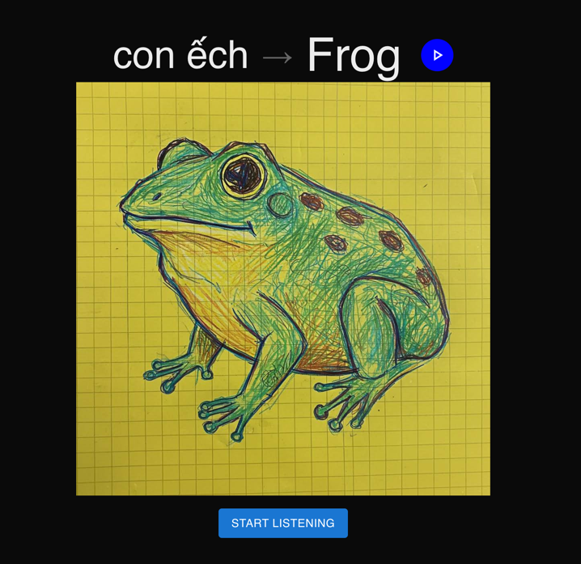

# AI Image Dictionary 

A modern web application that helps users visualize words through images, built with Next.js. This project provides an interactive interface for generating and viewing images based on word inputs.
This application is designed to get words from the user and generate English words with images using the Google Custom Search API or Together AI for image generation. It features a responsive design and is built with TypeScript for type safety.



## Features

- 🖼️ Interactive image dictionary interface
- 🔄 Word to image generation
- 💻 Modern, responsive UI
- 🐳 Docker support for easy deployment

## Tech Stack

- [Next.js](https://nextjs.org/) - React framework for production
- TypeScript - For type-safe code
- Docker - For containerized deployment

## Getting Started

## Environment Variables

Create a `.env.local` file in the root directory with the following variables:

```shell
# if using Together AI for image generation
TOGETHER_API_KEY=<your_together_api_key> 

# default service for image generation
GOOGLE_API_KEY=<your_google_api_key> 
```

### Environment Variables Reference

To get Google API keys, follow these steps:
1. Go to the [Google Cloud Console](https://console.cloud.google.com/).
2. Create a new project or select an existing one.
3. Navigate to "APIs & Services" > "Credentials".
4. Click "Create credentials" and select "API key".
5. Enable the "Google Custom Search API" for your project.
6. Copy the generated API key and paste it into your `.env.local` file.

### Prerequisites

- Node.js 18 or later
- npm, yarn, or pnpm package manager
- Docker (optional, for containerized deployment)

### Local Development

1. Install dependencies:
```bash
npm install
```

2. Run the development server:
```bash
npm run dev
```

Open [http://localhost:3000](http://localhost:3000) with your browser to see the result.

### Docker Deployment

You have two options for running the application with Docker:

#### Using Docker Compose (Recommended)

1. Create a `.env.local` file with your environment variables
2. Run with docker-compose:
```bash
docker-compose up -d
```

The application will be available at [http://localhost:3002](http://localhost:3002).

## Project Structure

```
├── public/          # Static assets
│   ├── file.svg    # UI icons and images
│   ├── globe.svg
│   ├── next.svg
│   ├── vercel.svg
│   └── window.svg
├── src/
│   ├── app/        # Next.js app directory
│   │   ├── layout.tsx  # Root layout component
│   │   └── page.tsx   # Main page component
│   ├── components/ # React components
│   │   └── ImageDictionary.tsx  # Main image dictionary component
│   └── tools/      # Utility functions and tools
│       ├── GenWord.ts          # Word generation utilities
│       └── GoogleGenImage.ts   # Image generation service
├── docker-compose.yml  # Docker Compose configuration
├── Dockerfile         # Docker configuration
├── next.config.ts    # Next.js configuration
└── tsconfig.json     # TypeScript configuration
```

### Key Components

- `ImageDictionary.tsx`: Main component that handles the dictionary interface
- `GoogleGenImage.ts`: Service for generating images from words
- `GenWord.ts`: Utility for word processing and generation

## Development Resources

To learn more about Next.js, take a look at the following resources:

- [Next.js Documentation](https://nextjs.org/docs) - learn about Next.js features and API.
- [Learn Next.js](https://nextjs.org/learn) - an interactive Next.js tutorial.

You can check out [the Next.js GitHub repository](https://github.com/vercel/next.js) - your feedback and contributions are welcome!

## Deployment

This application can be deployed in multiple ways:

1. **Docker Deployment**: Use the provided Dockerfile for containerized deployment
2. **Vercel**: Deploy directly to [Vercel Platform](https://vercel.com/new) for the easiest deployment experience
3. **Self-hosted**: Deploy to your own infrastructure using the production build

For detailed deployment instructions, check out our [Next.js deployment documentation](https://nextjs.org/docs/app/building-your-application/deploying).

## Contributing

Contributions are welcome! Please feel free to submit a Pull Request.

## License

This project is licensed under the MIT License - see the LICENSE file for details.
